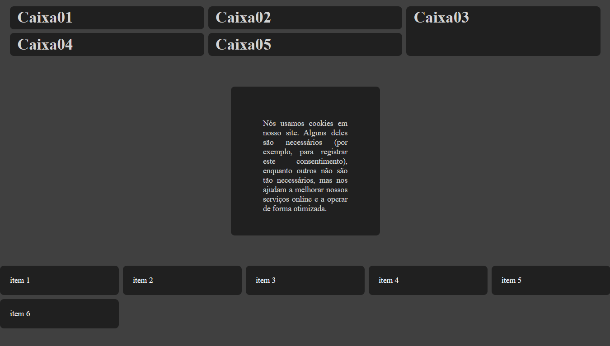
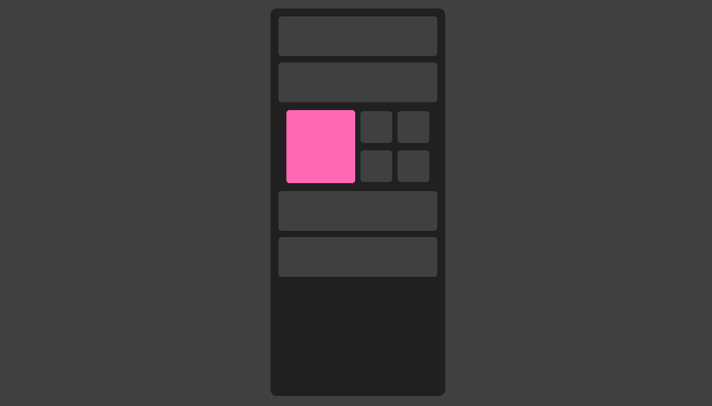

# GM Developer │ BENTO-GRID

# Imagem do Projeto

O CSS Grid Layout é um poderoso sistema bidimensional de layout que permite a criação de designs de página complexos de forma simples e eficiente. Este estudo busca explorar as funcionalidades, vantagens, e melhores práticas do uso do CSS Grid em desenvolvimento web moderno.

